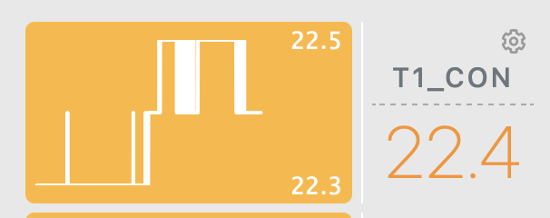
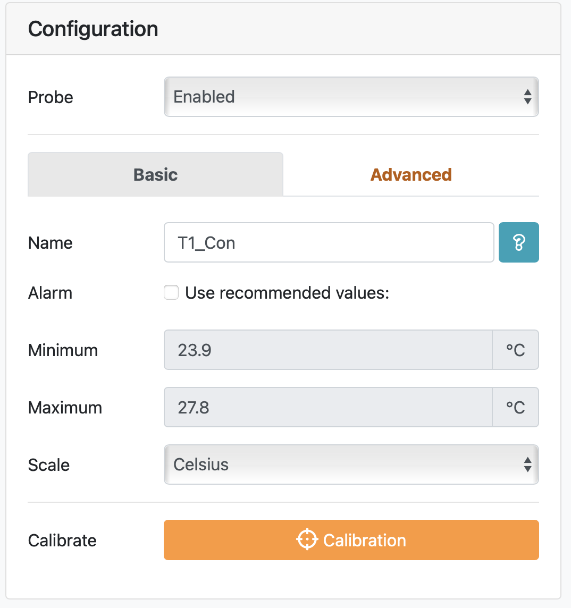
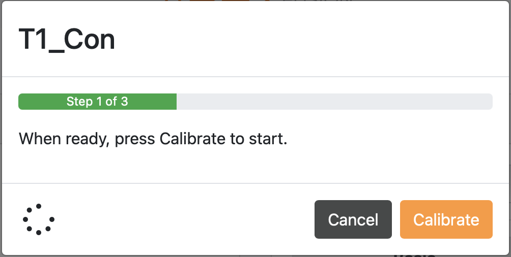
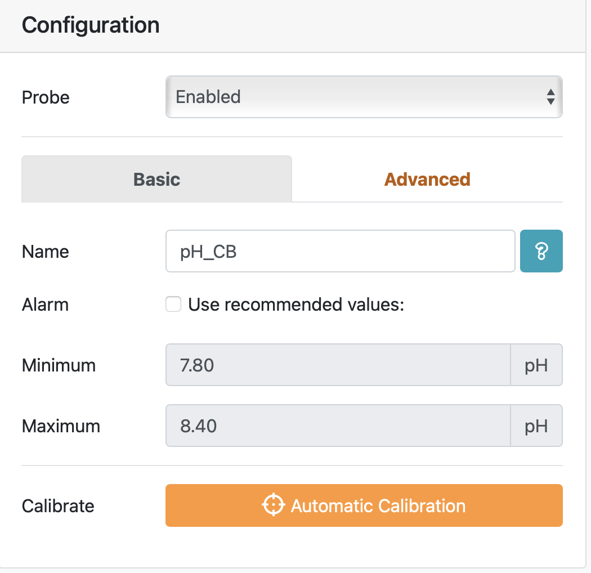
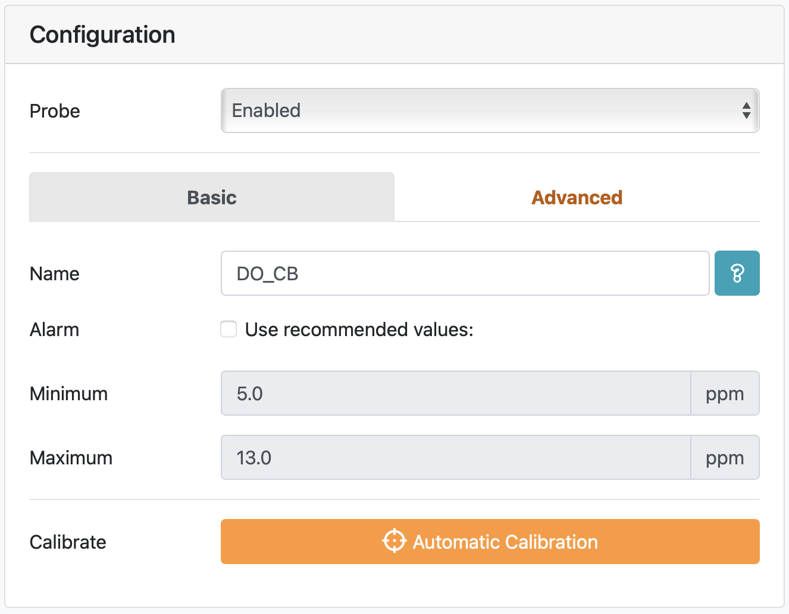

# Probe calibration
While the Apex calibrations are fairly straightforward and prompted through the [Apex Fusion app/website](apexfusion.com), there are specific protocols listed here to ensure probe longevity and accurate readings.

# Table of Contents
1. [Temperature](#Temperature-probes)
2. [pH](#pH-probes)
3. [DO](#DO-probes)

# Temperature probes
[PM1 manual](https://www.neptunesystems.com/downloads/docs/PM1_manual.pdf) &
[PM3 manual](https://www.neptunesystems.com/downloads/docs/PM3_manual.pdf)

The pH and the DO probes are temperature dependent. There are 2 temperature probes per tank/bucket, each one plugged into a separate module. One is used for the pH temperature compensation (PM1 module), and one is used for the DO temperature compensation (PM3 module).
> T1 = PM1 module temp probe (pH)\
> T3 = PM3 module temp probe (DO)

*Be sure to **calibrate both** and to start calibrations with temperature probes!!*

### Materials needed
* DI water
* Kim wipes
* Discrete temperature probe
* Apex temperature probes to be calibrated
* Laptop or phone with [Apex Fusion](apexfusion.com) website loaded

### Procedure
1. Before beginning the actual calibration, prepare the temperature probe.
  * Spray off the metal probe with DI water and wipe dry with a Kim wipe.
  * **Note**: for buckets with larvae, you will need to do this in between measuring each bucket
2. Log into the plomee Apex fusion account
3. Locate the temperature probe you want to calibrate on the dashboard and click on the gear icon associated with that probe.

4. On the right hand side of the screen you will see a box that looks like the image below. Remaining under the `Basic` tab, select the orange `Calibration` button.

5. A screen like this one will appear, and at this stage you will simply follow the prompts given on screen. It will have you input a discrete temperature measurement (using the metal probe you just cleaned).

The discrete temperature probe will take a while to settle, but at some point will stabilize around a number. Try to keep the probe box and wire as still as possible while reading as movement causes a longer time to stabilizing.
6. Once you have completed the measurement, entered the value and received the prompt that the calibration is `Done`, **do not forget to push the calibration back to Apex with the cloud button at the top right!!!**

7. After successfully sending the configuration, move on to the next temperature probe. Since their are **TWO** probes in each tank, you can quickly move on to the paired probe and calibrate that one to the tank temperature just measured. *And don't forget to push it back to Apex!*

In this example, you would calibrate **T1_Con** and **T3_Con** with the same discrete tank measurement since both probes are in that one tank.  

# pH probes
[PM1 and pH probe manual](https://www.neptunesystems.com/downloads/docs/PM1_manual.pdf)

### Notes about pH probes:

These probes are very sensitive and require great care in handling. Be very gentle with them, particularly the end with the glass sensors.

When you are finished with the calibration and any time you are looking in the tank/bucket ensure that the probe is not fully submerged. This reduces the lifetime of the probe. You want the black, rubber top to be out of the water along with a couple centimeters of the blue section.

\****[include picture here]\****

### Materials needed
* DI water in falcon tube
* Kim wipes
* pH 7.0 calibration buffer
* pH 10.01 calibration buffer
* Labeled falcon tubes for each buffer
* Floats for tubes
* Apex pH probes to be calibrated
* Laptop or phone with [Apex Fusion](apexfusion.com) website loaded
* Parafilm

### Procedure
1. *Thoroughly mix the calibration buffers (this is important!)*. Pour 20ml of each in to corresponding labeled falcon tubes. Pour one set for each rack.
2. Several minutes before beginning calibration, place tightly closed buffer tubes in float and set in a tank to allow it to get to the tank temperature.
3. Access the calibration screen for the pH probe (via gear icon). You should have something that looks like this. Select `Automatic Calibration`.
  
4. Similar to the temp probe, this will walk you thorough the process. Going forward, follow the on screen prompts after prepping the probe.
5. Probe prep:
  * Carefully remove from tank so it's easier to access
  * If the tank has larvae, be sure to spray off the probe into the bucket with filtered seawater before beginning
  * Dry off the saltwater gently with a kim wipe (shaft and the end very gently with the corners of the kim wipe)
  * Submerge the probe in DI water, mix around, and dry off with a clean kim wipe just as you did above
6. Calibration
  * When prompted, submerge probe in the pH 7 buffer, *mixing while the probe is reading*
  * When prompted to move on, dry off the probe with a kim wipe
  * When prompted, submerge in the pH 10 buffer and *mix*
7. Rinse and return
  * Following a successful calibration, dry off the probe thoroughly, rinse well in DI, dry, and return to the tank
8. **Do not forget to push the calibration back to Apex with the cloud button at the top right!!!**
9. Move on to the next probe, keeping the calibration buffers floating in the tank to keep them at water temp.
10. After all probes are calibrated, double check that all buffer bottles and tubes are *tightly* closed and wrapped with parafilm. This will reduce the amount of evaporation and/or CO2 contamination that can occur and degrade buffers.

# DO probes

[PM3 and DO probe manual](https://www.neptunesystems.com/downloads/docs/PM3_manual.pdf)

### Materials needed
* Towels
* Apex PM3 Zero Adapter (located on the back table in falcon tube holder)
* Apex DO probes to be calibrated
* Laptop or phone with [Apex Fusion](apexfusion.com) website loaded

### Procedure
1. Navigate to the calibration screen for the DO probe (via the gear icon). Your screen should look like this.

2. Select `Automatic Calibration`, and follow the on-screen prompts for calibration.
  * **Note:** If the tank has larvae, be sure to spray off the probe into the bucket with filtered seawater before beginning

General overview:
  * unglug the probe from the PM3 module
  * plug in the zero adapter
  * wait for reading to settle
  * unplug zero adapter and plug in probe
  * remove probe from tank and carefully dry the membrane with a towel
  * wait for reading to settle
  * return probe to tank

3. **Do not forget to push the calibration back to Apex with the cloud button at the top right!!!**
